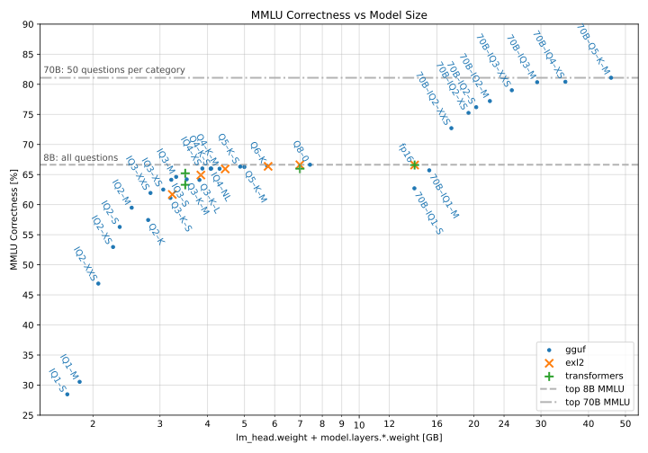
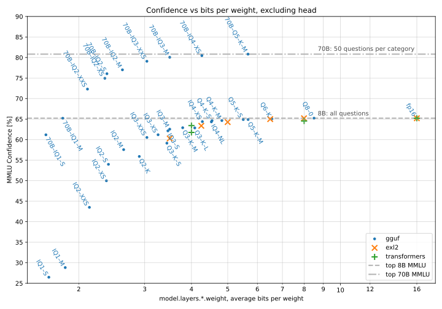

[**Llama 3**](https://github.com/meta-llama/llama3/blob/main/MODEL_CARD.md) is an amazing open large language model.
The **70B** variant's weights were published as 130 GB of `bfloat16` tensors in `safetensors` format.
The smaller variant, **8B**, weighs 15 GB.
Thanks to quantization methods, we can run these models on consumer hardware while retaining good quality.
I tested how much quantization affects the **Instruct** variant of these models, using [the MMLU test.](https://github.com/hendrycks/test)

# Results

## Quick intro

<details> <summary>What's MMLU?</summary>

The "Massive Multitask Language Understanding" test is composed of 14042 multiple choice questions, non-uniformly distributed among 57 categories. "Correctness" in this article refers to the % of questions the model answered correctly.

<details> <summary>Example question</summary>

Question 45 from the "high school mathematics" category, formatted for Llama 3-Instruct:

> <|start_header_id|>user<|end_header_id|>
> 
> Question:
> To place the first paving stone in a path, Alex starts at the crate of stones, walks three feet, places the stone, and returns to the crate. For each subsequent stone, Alex walks two feet farther each way. Alex will place the first 50 stones in a path. After returning to the crate from placing the $50^\text{th}$ stone, what is the total distance Alex walked, in feet?
> 
> Choices:  
> A: 100  
> B: 90950  
> C: 5200  
> D: 50<|eot_id|><|start_header_id|>assistant<|end_header_id|>
> 
> Answer:

To which a model is expected to reply with a single token, saying ` A`, ` B`, ` C`, or ` D`. Here, C is correct.

</details>

<details> <summary>Question count per category</summary>

  | | Question Count | Category |
| --:| --:|:-- |
|  1. |  100 | abstract algebra |
|  2. |  135 | anatomy |
|  3. |  152 | astronomy |
|  4. |  100 | business ethics |
|  5. |  265 | clinical knowledge |
|  6. |  144 | college biology |
|  7. |  100 | college chemistry |
|  8. |  100 | college computer science |
|  9. |  100 | college mathematics |
| 10. |  173 | college medicine |
| 11. |  102 | college physics |
| 12. |  100 | computer security |
| 13. |  235 | conceptual physics |
| 14. |  114 | econometrics |
| 15. |  145 | electrical engineering |
| 16. |  378 | elementary mathematics |
| 17. |  126 | formal logic |
| 18. |  100 | global facts |
| 19. |  310 | high school biology |
| 20. |  203 | high school chemistry |
| 21. |  100 | high school computer science |
| 22. |  165 | high school european history |
| 23. |  198 | high school geography |
| 24. |  193 | high school government and politics |
| 25. |  390 | high school macroeconomics |
| 26. |  270 | high school mathematics |
| 27. |  238 | high school microeconomics |
| 28. |  151 | high school physics |
| 29. |  545 | high school psychology |
| 30. |  216 | high school statistics |
| 31. |  204 | high school us history |
| 32. |  237 | high school world history |
| 33. |  223 | human aging |
| 34. |  131 | human sexuality |
| 35. |  121 | international law |
| 36. |  108 | jurisprudence |
| 37. |  163 | logical fallacies |
| 38. |  112 | machine learning |
| 39. |  103 | management |
| 40. |  234 | marketing |
| 41. |  100 | medical genetics |
| 42. |  783 | miscellaneous |
| 43. |  346 | moral disputes |
| 44. |  895 | moral scenarios |
| 45. |  306 | nutrition |
| 46. |  311 | philosophy |
| 47. |  324 | prehistory |
| 48. |  282 | professional accounting |
| 49. | 1534 | professional law |
| 50. |  272 | professional medicine |
| 51. |  612 | professional psychology |
| 52. |  110 | public relations |
| 53. |  245 | security studies |
| 54. |  201 | sociology |
| 55. |  100 | us foreign policy |
| 56. |  166 | virology |
| 57. |  171 | world religions |

</details>

</details>

<details> <summary>What's quantization?</summary>

"Quantizing" a model means converting parts of it to lower precision numerical representations to lower its memory use.
This can allow running large models on limited hardware, but may hurt quality. [Learn more!](https://huggingface.co/docs/peft/main/en/developer_guides/quantization)

</details>

<details> <summary>Bits per weight, bpw?</summary>

Quantization methods typically use mixed precision, expressing different parts of a model in different ways. A way to characterize quantization in one number is to divide its size (or the size of quantized parts of the model) in bits by its number of parameters (weights). Mind that the number of parameters is typically expressed in metric "engineering" units (powers of 1000), and file size in JEDEC units (powers of 1024), so the formula is:

```
bpw = (1024/1000)^3 (size in GB) / (billions of parameters) ≈
    ≈ 1.0737 (size in GB) / (billions of parameters)
```

</details>

<details> <summary>EXL2? GGUF?</summary>

These are popular quantized LLM file formats, working with [Exllama v2](https://github.com/turboderp/exllamav2) and [llama.cpp](https://github.com/ggerganov/llama.cpp/), respectively.

</details>

## Correctness vs Model Size

The following plot shows how the models slowly lose the ability to answer MMLU questions correctly the more quantized they are.



- The points labeled "70B" correspond to the 70B variant of the Llama 3 model, the rest the 8B variant.
- "gguf" used [files](https://huggingface.co/bartowski/Meta-Llama-3-8B-Instruct-GGUF) provided by `bartowski`. The "Q-numbers" don't correspond to bpw (bits per weight) exactly (see [next plot](#confidence-vs-bpw)).
- "exl2" also used [files](https://huggingface.co/bartowski/Meta-Llama-3-8B-Instruct-exl2) provided by `bartowski`, in fp16, 8 bpw, 6.5 bpw, 5 bpw, 4.25 bpw, 3.5 bpw.
- "transformers" refers to evaluating the model using the HuggingFace `transformers` module and its supported `bitsandbytes` quantization-on-load options: 8 bit, 4 bit fp4, 4 bit nf4 (normalized float). nf4 is the better performing one.
- The "model size" here is file size minus the size of the embeddings (which don't get loaded into VRAM) but it does include the head size. It's not easy to fairly compare different frameworks. As an example, I included the exact sizes of layers in a few variants [at the end of the article.](#the-tensors)

<details> <summary>Data table</summary>

\* Note: the 70B model was evaluated with only 50 questions per category, the 8B with full MMLU.

bpw here was calculated only considering Llama 3's `model.layers.*.weight` layers, as the approach to quantizing the rest of the model differs significantly between methods.

| Model size [GB] | MMLU [%] | bpw | Model | Quant | Type |
| --:| --:| --:|:--:|:--:|:--:|
| 45.84 | \* 80.82 |  5.66 | 70B | Q5_K_M | GGUF |
| 34.77 | \* 80.46 |  4.26 | 70B | IQ4_XS | GGUF |
| 29.32 | \* 80.06 |  3.50 | 70B | IQ3_M | GGUF |
| 25.16 | \* 79.09 |  3.04 | 70B | IQ3_XXS | GGUF |
| 22.04 | \* 77.01 |  2.62 | 70B | IQ2_M | GGUF |
| 20.29 | \* 76.05 |  2.38 | 70B | IQ2_S | GGUF |
| 19.36 | \* 74.94 |  2.35 | 70B | IQ2_XS | GGUF |
| 17.46 | \* 72.31 |  2.11 | 70B | IQ2_XXS | GGUF |
| 15.27 | \* 65.21 |  1.81 | 70B | IQ1_M | GGUF |
| 13.98 | 65.20 | 16.00 | 8B | fp16 | GGUF |
| 13.98 | 65.20 | 16.00 | 8B | fp16 | Exl2 |
| 13.98 | 65.21 | 16.00 | 8B | bf16 | transformers |
| 13.96 | \* 61.18 |  1.63 | 70B | IQ1_S | GGUF |
|  7.43 | 65.23 |  8.50 | 8B | Q8_0 | GGUF |
|  6.99 | 64.53 |  8.00 | 8B | 8bit | transformers |
|  6.99 | 65.20 |  7.99 | 8B | 8bit | Exl2 |
|  5.77 | 64.99 |  6.49 | 8B | 8bit | Exl2 |
|  5.73 | 65.06 |  6.56 | 8B | Q6_K | GGUF |
|  5.00 | 64.90 |  5.67 | 8B | Q5_K_M | GGUF |
|  4.87 | 64.88 |  5.50 | 8B | Q5_K_S | GGUF |
|  4.45 | 64.27 |  5.00 | 8B | Q5_K_S | Exl2 |
|  4.30 | 64.64 |  4.82 | 8B | Q4_K_M | GGUF |
|  4.09 | 64.63 |  4.54 | 8B | Q4_K_S | GGUF |
|  4.07 | 64.33 |  4.52 | 8B | IQ4_NL | GGUF |
|  3.87 | 64.39 |  4.28 | 8B | IQ4_XS | GGUF |
|  3.84 | 63.36 |  4.25 | 8B | IQ4_XS | Exl2 |
|  3.81 | 62.85 |  4.08 | 8B | Q3_K_L | GGUF |
|  3.53 | 62.89 |  3.79 | 8B | Q3_K_M | GGUF |
|  3.49 | 63.42 |  4.00 | 8B | 4bitnf4 | transformers |
|  3.49 | 61.75 |  4.00 | 8B | 4bitfp4 | transformers |
|  3.31 | 62.55 |  3.50 | 8B | IQ3_M | GGUF |
|  3.23 | 60.28 |  3.50 | 8B | IQ3_M | Exl2 |
|  3.21 | 62.13 |  3.46 | 8B | IQ3_S | GGUF |
|  3.20 | 59.14 |  3.44 | 8B | Q3_K_S | GGUF |
|  3.06 | 61.19 |  3.26 | 8B | IQ3_XS | GGUF |
|  2.83 | 60.52 |  3.04 | 8B | IQ3_XXS | GGUF |
|  2.79 | 55.90 |  2.90 | 8B | Q2_K | GGUF |
|  2.53 | 57.56 |  2.64 | 8B | IQ2_M | GGUF |
|  2.35 | 53.98 |  2.40 | 8B | IQ2_S | GGUF |
|  2.26 | 49.98 |  2.37 | 8B | IQ2_XS | GGUF |
|  2.07 | 43.50 |  2.14 | 8B | IQ2_XXS | GGUF |
|  1.85 | 28.83 |  1.84 | 8B | IQ1_M | GGUF |
|  1.71 | 26.47 |  1.66 | 8B | IQ1_S | GGUF |

</details>

<details> <summary>Selected results per category</summary>

This table shows average **confidence** per category. Since 70B models were only evaluated on 50 questions per category, and some categories had 500+, the individual results may not be very comparable between 70B and 8B.
  
|category|70B-Q5_K_M|70B-IQ2_XXS|8B-Q8_0|8B-IQ2_M|
|--|--:|--:|--:|--:|
|marketing|98.1%|94.2%|89.0%|83.2%|
|high school government and politics|98.1%|97.8%|90.1%|80.8%|
|medical genetics|96.6%|85.3%|82.7%|71.0%|
|jurisprudence|96.0%|93.7%|78.0%|71.0%|
|high school us history|95.3%|89.0%|80.0%|70.3%|
|high school psychology|94.8%|91.7%|84.1%|76.5%|
|high school microeconomics|93.9%|80.8%|75.9%|62.0%|
|human sexuality|93.5%|81.3%|77.7%|66.1%|
|astronomy|93.4%|81.2%|70.9%|62.3%|
|business ethics|93.2%|76.0%|66.6%|60.0%|
|us foreign policy|92.6%|91.2%|85.9%|78.3%|
|prehistory|92.5%|85.2%|73.7%|64.5%|
|nutrition|92.0%|89.9%|76.3%|64.1%|
|high school world history|91.3%|88.7%|82.8%|73.8%|
|college biology|90.9%|85.1%|79.3%|67.0%|
|high school geography|90.9%|85.7%|83.8%|74.2%|
|miscellaneous|90.5%|86.8%|82.8%|75.6%|
|high school computer science|90.3%|83.3%|71.2%|62.9%|
|management|89.9%|88.4%|83.5%|73.8%|
|sociology|89.5%|83.6%|84.4%|79.4%|
|international law|87.9%|86.4%|78.2%|69.7%|
|conceptual physics|87.4%|82.4%|57.0%|47.8%|
|world religions|87.2%|82.1%|82.5%|77.5%|
|professional medicine|86.8%|76.4%|71.7%|58.2%|
|philosophy|86.7%|73.2%|71.4%|66.1%|
|computer security|86.5%|86.5%|76.7%|73.7%|
|moral scenarios|86.0%|49.3%|43.5%|33.3%|
|human aging|85.4%|83.8%|71.8%|64.7%|
|high school biology|84.7%|79.0%|80.3%|71.1%|
|college medicine|84.4%|74.3%|65.6%|59.6%|
|logical fallacies|84.3%|77.6%|77.8%|69.6%|
|professional psychology|83.8%|75.5%|69.4%|60.9%|
|high school european history|83.2%|79.6%|77.9%|72.6%|
|clinical knowledge|82.5%|72.6%|75.0%|65.2%|
|high school macroeconomics|82.1%|79.2%|66.3%|55.9%|
|anatomy|81.7%|66.2%|69.6%|56.7%|
|electrical engineering|81.0%|71.8%|62.8%|55.7%|
|security studies|78.7%|77.5%|72.9%|68.5%|
|high school statistics|77.9%|53.1%|52.6%|49.8%|
|public relations|77.7%|64.8%|70.2%|61.3%|
|elementary mathematics|75.7%|63.6%|46.0%|39.1%|
|machine learning|74.3%|62.8%|49.8%|42.5%|
|high school physics|72.2%|60.7%|37.9%|33.5%|
|moral disputes|69.5%|60.6%|72.5%|64.7%|
|high school chemistry|65.8%|59.4%|52.0%|44.4%|
|college computer science|65.6%|57.5%|55.0%|50.6%|
|college physics|65.2%|49.9%|45.7%|43.0%|
|formal logic|62.5%|50.1%|49.7%|42.2%|
|econometrics|61.9%|52.2%|53.0%|41.5%|
|abstract algebra|60.7%|41.7%|29.7%|29.5%|
|college mathematics|60.0%|43.1%|36.6%|31.1%|
|virology|59.1%|55.6%|51.6%|49.6%|
|professional law|58.0%|52.6%|46.8%|41.6%|
|global facts|56.7%|44.6%|39.1%|33.0%|
|professional accounting|54.8%|45.4%|52.1%|47.1%|
|high school mathematics|54.1%|44.4%|34.9%|29.6%|
|college chemistry|52.7%|49.4%|45.1%|40.7%|

</details>

### Key takeaways:
- Modern GGUF "I-Quants" seem to offer the best quality at given size.
- All tested quantization formats perform the same at fp16.
- Going as low as ~5 bpw has minimal impact on quality in this test.
- `transformers` quantization is slightly lower quality, except `bitsandbytes` 4 bit **nf4** which interestingly keeps up with GGUF, beating all "\*Q3\*" quants.

### Is exllamav2 under-performing?
For lower bpw it seems to score lower on MMLU compared to GGUF of the same *file size.*
However, file size does not exactly correlate to the memory a model will use.
Considering the average bpw  of the quantized layers (as in the next figure) may be a more fair comparison.
Still, ExLlamaV2 offers some advantages:
- It *can be* faster than fully offloaded GGUF, depending on the task. In this test it was almost twice as fast, processing 14 thousand tokens per second vs 7500 for llama.cpp.
It seems that for the same bpw, EXL2 resulted in worse MMLU scores. But for now ExLlamaV2 still offers some unique advantages:
- It offers 4 bit cache, which allows quartering the memory necessary for context size. If you count context, EXL2 may become your best option until llama.cpp implements this feature (see: [1](https://github.com/ggerganov/llama.cpp/issues/6863), [2](https://github.com/ggerganov/llama.cpp/discussions/5932)). Especially if you need 16k+ context length.
- I personally found it to be easiest and most pleasant to work with from Python's level, but that's subjective and depends on the task.

## Confidence vs bpw

**Confidence** here is the average *normalized* probability that the model would give a correct answer *if we only consider the 4 tokens corresponding to valid answers.*
Random noise would result in 25% confidence (and 25% correctness) because I'm normalizing the 4 possible answers to add up to 100%.



The main takeaway here is that the 70B model is less affected by quantization. Perhaps it's more sparse relative to the 8B one.
Extremely low quants of 70B remain somewhat useable, whereas 8B-IQ1-M and -S are near the random noise threshold.


Here I plotted the loss of confidence (change from maximum). It seems to change like $\propto \text{bpw}^{-4.25}$.
I had to include this, because no one can resist "things looking linear on a log-log plot."

# Methodology

## Shortcomings of this test

- To calculate MMLU, I made a mistake of using the first five questions in each "test" category for 5-shot evaluation, instead of using the "dev" set. This changes the MMLU values slightly, but isn't an issue in this study, as I'm only comparing my own tests to one another and focusing on their relative differences.
- I skipped around 20 questions where the 5-shot prompt was above 2048 tokens.

## Applicability of this test

From anecdotal experience, it seems that quantization affects "rigorous" tasks like writing working source code more than open-ended tasks like creative writing. It would be interesting to methodically measure the effect of quantization on demanding programming benchmarks.

## Shortcomings of MMLU

### It's *okay* for this purpose

For this study, MMLU is fine because it's an ablation study. Even if MMLU is a flawed quality benchmark, it's *good enough* to see how a model's answers change with quantization.

### Is MMLU still relevant?

It *used to be* arguable whether MMLU is a good benchmark, but it does not really matter any more, as top models are scoring around 90%. There's not much room for improvement, but fortunately [harder benchmarks](https://lmsys.org/blog/2024-04-19-arena-hard/) are being proposed.

### It's partially broken

Some of MMLU questions are [broken, arguably useful, opinionated, or lack necessary context.](https://derenrich.medium.com/errors-in-the-mmlu-the-deep-learning-benchmark-is-wrong-surprisingly-often-7258bb045859)
Example, question 133 from the "high school psychology" category:

> As a result of an accident, Abdul lost sight in his right eye. To judge the distance of vehicles when he is driving, Abdul is able to rely on cues of
> 
> A. I only  
> B. II only  
> C. III only  
> D. I and II only  

This question lacks statements numbered I, II, and III necessary to answer it.

## Inference code

I based my code on the test included in [ExLlamaV2's repository,](https://github.com/turboderp/exllamav2/blob/master/tests/test_mmlu.py) but modified it heavily.

You can find pre-compiled Python wheels for inference libraries listed in the [text-generation-webui repository.](https://github.com/oobabooga/text-generation-webui/blob/dev/requirements.txt)

The MMLU dataset can be found [on HuggingFace](https://huggingface.co/datasets/cais/mmlu) and read with `pandas`.

The snippets assume that you load a list of strings representing the questions and answers as `prompts` and `answers`.

### transformers

<details> <summary>Simplified transformers source code</summary>

```py
import torch
import transformers

model_path = "path/to/model"

tokenizer = transformers.AutoTokenizer.from_pretrained(model_path)
config = transformers.PretrainedConfig.from_pretrained(model_path)
config.max_position_embeddings = 2048

quantization_config = transformers.BitsAndBytesConfig(
    load_in_4bit=True,
    bnb_4bit_quant_type="nf4",
    bnb_4bit_use_double_quant=False,
    bnb_4bit_compute_dtype=torch.float16,
    llm_int8_enable_fp32_cpu_offload=True,
)

model = transformers.LlamaForCausalLM.from_pretrained(
    model_path,
    torch_dtype=torch.float16,
    config=config,
    device_map="auto",
    attn_implementation="flash_attention_2",
    low_cpu_mem_usage=True,
    quantization_config=quantization_config,
)

answer_tokens = tokenizer.encode(
    " A B C D", add_special_tokens=False, return_tensors="pt"
)

with torch.no_grad(): # crucial for lower memory use
    for prompt, answer in zip(prompts, answers):
        prompt_ids = tokenizer.encode(
            prompt, add_special_tokens=False, return_tensors="pt"
        )

        logits_ans = model.forward(prompt_ids.cuda()).logits[:, -1, answer_tokens].cpu()
        # process the answer
        torch.cuda.empty_cache()
```

</details>

### llama-cpp-python

Mind to install a correct version of `llama-cpp-python`, with CUDA support if you can use it. Adjust `n_gpu_layers` if you can't offload the full model. A model's total number of layers is listed in its `config.json` as `num_hidden_layers`.

<details> <summary>Simplified llama-cpp-python source code</summary>

```py
import torch
from llama_cpp_cuda_tensorcores import Llama, llama_tokenizer

model_path = "path/to/model.gguf"
tokenizer_base = "path/to/model"  # where tokenizer.json is located

llama_params = {
    "model_path": model_path,
    "n_ctx": 2048,  # Text context, 0 = from model
    "n_batch": 512,  # Prompt processing maximum batch size
    "n_gpu_layers": -1,  # -1 offloads ALL layers
    "n_threads": 8,  # Number of threads to use for generation
    "n_threads_batch": 8,  # Number of threads to use for batch processing
    "logits_all": False,  # Not needed for model.eval()
    "offload_kqv": True,  # Offload K, Q, V to GPU.
    "tokenizer": llama_tokenizer.LlamaHFTokenizer.from_pretrained(
        tokenizer_base
    ),  # Optional tokenizer to override the default tokenizer from llama.cpp.
    "verbose": False,  # Don't print verbose output to stderr.
}

model = Llama(**llama_params)

answer_tokens = model.tokenize(" A B C D".encode(), add_bos=False)

for prompt, answer in zip(prompts, answers):
    prompt_ids = model.tokenize(prompt.encode(), add_bos=False)

    model.reset()
    model.eval(prompt_ids)
    logits = model.scores[model.n_tokens - 1]
    logits_ans = torch.tensor([logits[i] for i in answer_tokens], device="cpu")
```

</details>

### ExLlamaV2

<details> <summary>Simplified ExLlamaV2 source code</summary>

```py
from exllamav2 import (
    ExLlamaV2,
    ExLlamaV2Cache,
    ExLlamaV2Config,
    ExLlamaV2Tokenizer,
)

model_path = "path/to/model-exl2"
config = ExLlamaV2Config()
config.model_dir = model_path
config.prepare()
config.max_seq_len = 2048
model = ExLlamaV2(config)
tokenizer = ExLlamaV2Tokenizer(config)
cache = ExLlamaV2Cache(model, max_seq_len=2048, lazy=True)
model.load_autosplit(cache)

answer_logits = tokenizer.encode(" A B C D")

for prompt, answer in zip(prompts, answers):
    prompt_ids = tokenizer.encode(prompt)
    logits = model.forward(prompt_ids, last_id_only=True)
    logits_ans = logits[:, :, answer_logits].cpu()
```

</details>

Evaluating the results from `logits_ans` involves checking if the highest logit corresponds to the correct answer.
To measure confidence, record the normalized probability for the correct answer. Here, `answer_id is in {0, 1, 2, 3}` and corresponds to the correct answer token.

```py
prob_ans = torch.softmax(logits_ans, dim=-1)
confidence = float(prob_ans[0, answer_id])
correct = bool(prob_ans.argmax() == answer_id)
```

Lastly, record the individual results per question or compute the averages, minding the varying number of questions per category.

## The Tensors

<details> <summary>Size of individual model layers</summary>

This table compares the layer sizes of:
- the original transformers Llama 8B in bfloat16
- EXL2 8.0 bpw
- GGUF Q8_0 (which is ~8.5 bpw)

| layer | transformers [bytes] | EXL2 [bytes] | EXL2 [bpw] | GGUF [bytes] | GGUF [bpw] |
|:-- | --:| --:| --:| --:| --:|
| model.embed_tokens         |  1 050 673 152 |  1 050 673 152 | 16.00 |    558 170 112 |  8.50 |
| lm_head                    |  1 050 673 152 |    527 405 248 |  8.03 |    558 170 112 |  8.50 |
| model.norm                 |          8 192 |          8 192 | 16.00 |         16 384 | 32.00 |
| *.input_layernorm          |        262 144 |        262 144 | 16.00 |        524 288 | 32.00 |
| *.self_attn.q_proj         |  1 073 741 824 |    539 498 496 |  8.04 |    570 425 344 |  8.50 |
| *.self_attn.k_proj         |    268 435 456 |    135 272 448 |  8.06 |    142 606 336 |  8.50 |
| *.self_attn.v_proj         |    268 435 456 |    135 272 448 |  8.06 |    142 606 336 |  8.50 |
| *.self_attn.o_proj         |  1 073 741 824 |    539 498 496 |  8.04 |    570 425 344 |  8.50 |
| *.post_attention_layernorm |        262 144 |        262 144 | 16.00 |        524 288 | 32.00 |
| *.mlp.down_proj            |  3 758 096 384 |  1 875 792 896 |  7.99 |  1 996 488 704 |  8.50 |
| *.mlp.gate_proj            |  3 758 096 384 |  1 874 073 600 |  7.98 |  1 996 488 704 |  8.50 |
| *.mlp.up_proj              |  3 758 096 384 |  1 874 073 600 |  7.98 |  1 996 488 704 |  8.50 |
| model.layers.*             | 13 959 168 000 |  6 974 006 272 |  7.99 |  7 416 578 048 |  8.50 |

All the "\*." layers add up to "model.layers.\*".

</details>
